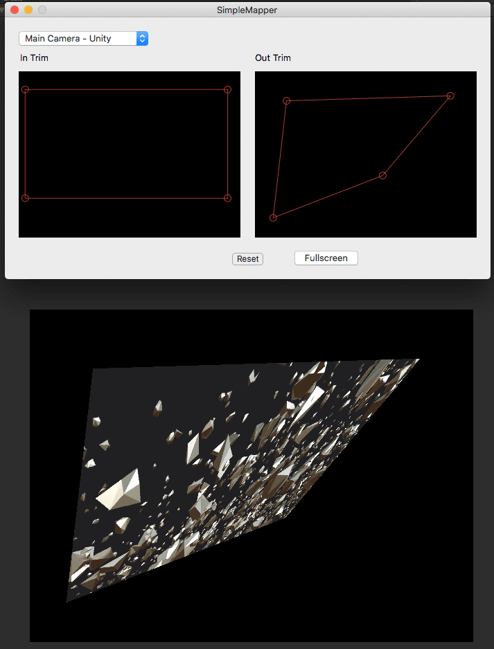

Simple Mapper
===

Simple Mapper is a simple [Syphon](http://syphon.v002.info/) client for a video installation and a projection mapping.

- Cmd-F: Toggle Full screen
- Cmd-E: Show Editor window

It automatically saves and loads settings.

